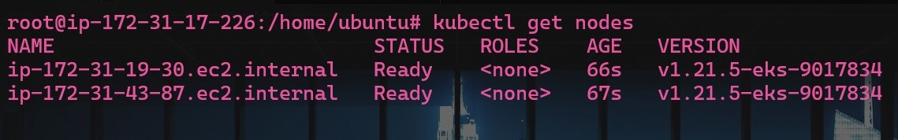

[](https://github.com/infraform/terraform-elastic-kubernetes/actions/workflows/terraform_plan.yml) [](https://github.com/infraform/terraform-elastic-kubernetes/actions/workflows/pages/pages-build-deployment)

# AWS Elastic Kubernetes Service (EKS)

## Description

<!--  
 -->

Amazon Elastic Kubernetes Service (Amazon EKS) is a managed service that makes it easy for you to run Kubernetes on AWS without needing to install and operate your own Kubernetes clusters.

Amazon EKS integrates with core AWS services such as CloudWatch, Auto Scaling Groups, and IAM to provide a seamless experience for monitoring, scaling and load balancing your containerized applications.


Amazon EKS integrates with AWS App Mesh and provides a Kubernetes-native experience to consume service mesh features and bring rich observability, traffic controls and security features to applications. Amazon EKS provides a scalable, highly-available control plane for Kubernetes workloads. When running applications on Amazon EKS, as with Amazon ECS, you can choose to provide the underlying compute power for your containers with EC2 instances or with AWS Fargate.

## Infrastructure Provisioning with Terraform

Using infrastructure as code to manage Kubernetes allows you to declare infrastructure components in configuration files, change to fit new conditions and tear down infrastructure in different cloud providers. Terraform is our tool of choice to mange the whole lifecycle of Kubernetes infrastructure.

### Set Providers

We will now set up several Terraform files to contain the various configurations. The first file will be named `provider.tf`. Create the file with the following contents:

```terraform
terraform {
  required_providers {
    aws = {
      source  = "hashicorp/aws"
      version = ">= 4.13.0"
    }
    kubernetes = {
      source  = "hashicorp/kubernetes"
      version = ">= 2.10.0"
    }
    tls = {
      source  = "hashicorp/tls"
      version = ">= 3.0"
    }
  }
}

provider "aws" {
  region = "us-east-1"
}
```

- While importing EKS module you get kubernetes and tls providers automatically.
- You can also define them manually if you want in `provider.tf`.

### Cluster

Now, create a file called `cluster.tf`. This will include our modules for a network, cluster, node pool and all the other resources that are required to run a Kubernetes cluster. We will use a officially-supported Terraform AWS module called `terraform-aws-modules/eks/aws`.

```terraform
module "eks" {
  source  = "terraform-aws-modules/eks/aws"
  version = "~> 18.0"

  cluster_name    = "my-cluster"
  cluster_version = "1.21"

  cluster_endpoint_private_access = true
  cluster_endpoint_public_access  = true

  cluster_addons = {
    coredns = {
      resolve_conflicts = "OVERWRITE"
    }
    kube-proxy = {}
    vpc-cni = {
      resolve_conflicts = "OVERWRITE"
    }
  }

  cluster_encryption_config = [{
    provider_key_arn = "ac01234b-00d9-40f6-ac95-e42345f78b00"
    resources        = ["secrets"]
  }]

  vpc_id     = "vpc-1234556abcdef"
  subnet_ids = ["subnet-abcde012", "subnet-bcde012a", "subnet-fghi345a"]

  # Self Managed Node Group(s)
  self_managed_node_group_defaults = {
    instance_type                          = "t3.medium"
    update_launch_template_default_version = true
    iam_role_additional_policies = [
      "arn:aws:iam::aws:policy/AmazonSSMManagedInstanceCore"
    ]
  }

  self_managed_node_groups = {
    one = {
      name         = "mixed-1"
      max_size     = 5
      min_size     = 2
      desired_size = 2


      use_mixed_instances_policy = true
      mixed_instances_policy = {
        instances_distribution = {
          on_demand_base_capacity                  = 0
          on_demand_percentage_above_base_capacity = 10
          spot_allocation_strategy                 = "capacity-optimized"
        }

        override = [
          {
            instance_type     = "t3.medium"
            weighted_capacity = "1"
          },
          {
            instance_type     = "t3.medium"
            weighted_capacity = "2"
          },
        ]
      }
    }
  }

  # EKS Managed Node Group(s)
  eks_managed_node_group_defaults = {
    disk_size      = 50
    instance_types = ["t3.medium"]
  }

  eks_managed_node_groups = {
    blue = {
      instance_types = ["t3.medium"]
      capacity_type  = "SPOT"
    }
    green = {
      min_size     = 1
      max_size     = 10
      desired_size = 1

      instance_types = ["t3.medium"]
      capacity_type  = "SPOT"
    }
  }

  # Fargate Profile(s)
  fargate_profiles = {
    default = {
      name = "default"
      selectors = [
        {
          namespace = "default"
        }
      ]
    }
  }

  # aws-auth configmap
  manage_aws_auth_configmap = true

  aws_auth_roles = [
    {
      rolearn  = "arn:aws:iam::66666666666:role/role1"
      username = "role1"
      groups   = ["system:masters"]
    },
  ]

  aws_auth_users = [
    {
      userarn  = "arn:aws:iam::66666666666:user/user1"
      username = "user1"
      groups   = ["system:masters"]
    },
    {
      userarn  = "arn:aws:iam::66666666666:user/user2"
      username = "user2"
      groups   = ["system:masters"]
    },
  ]

  aws_auth_accounts = [
    "123456789321",
    "123456789012",
  ]

  tags = {
    Environment = "dev"
    Team        = "Infraform"
    Terraform   = "true"
  }
}
```

- You need to specify the VPC ID, subnet IDs, cluster name, cluster version, cluster endpoint access, cluster addons, cluster encryption config, cluster tags and the required special informations for self-managed node groups and EKS managed node groups in `cluster.tf`.

### Initialize the Terraform Modules

Once the `cluster.tf` file is complete, initialize Terraform by running the following command:

```
terraform init
```

Terraform will create a directory named `.terraform` and download each module source declared in `provider.tf` or in module that imported. Initialization will pull in any providers demanded by these modules. You can see the resources that are being downloaded in the folder `.terraform`.

If you configured in providers, Terraform will also configure the backend for storing the state file. This is useful for storing the state of your Terraform configuration if you are planning to run Terraform in a CI environment or on a remote machine.

### Plan Terraform Resource Actions

After Terraform has been successfully initialized, run `terraform plan` to review what will be created:

```bash
terraform plan
```

You can see the resources that will be created in the output.

```terraform
Terraform used the selected providers to generate the following execution plan. Resource actions are indicated with the
following symbols:
  + create
 <= read (data resources)

Terraform will perform the following actions:

  # module.eks.data.tls_certificate.this[0] will be read during apply
  # (config refers to values not yet known)
 <= data "tls_certificate" "this"  {
      + certificates = (known after apply)
      + id           = (known after apply)
      + url          = (known after apply)
    }

  # module.eks.aws_cloudwatch_log_group.this[0] will be created
  + resource "aws_cloudwatch_log_group" "this" {
      + arn               = (known after apply)
      + id                = (known after apply)
      + name              = "/aws/eks/my-cluster/cluster"
      + retention_in_days = 90
      + tags              = {
          + "Environment" = "dev"
          + "Team"        = "Infraform"
          + "Terraform"   = "true"
        }
      + tags_all          = {
          + "Environment" = "dev"
          + "Team"        = "Infraform"
          + "Terraform"   = "true"
        }
    }

  # module.eks.aws_ec2_tag.cluster_primary_security_group["Environment"] will be created
  + resource "aws_ec2_tag" "cluster_primary_security_group" {
      + id          = (known after apply)
      + key         = "Environment"
      + resource_id = (known after apply)
      + value       = "dev"
    }

  # module.eks.aws_ec2_tag.cluster_primary_security_group["Team"] will be created
  + resource "aws_ec2_tag" "cluster_primary_security_group" {
      + id          = (known after apply)
      + key         = "Team"
      + resource_id = (known after apply)
      + value       = "Infraform"
    }

  # module.eks.aws_ec2_tag.cluster_primary_security_group["Terraform"] will be created
  + resource "aws_ec2_tag" "cluster_primary_security_group" {
      + id          = (known after apply)
      + key         = "Terraform"
      + resource_id = (known after apply)
      + value       = "true"
    }

  # module.eks.aws_eks_addon.this["coredns"] will be created
  + resource "aws_eks_addon" "this" {
      + addon_name        = "coredns"
      + addon_version     = (known after apply)
      + arn               = (known after apply)
      + cluster_name      = "my-cluster"
      + created_at        = (known after apply)
      + id                = (known after apply)
      + modified_at       = (known after apply)
      + resolve_conflicts = "OVERWRITE"
      + tags              = {
          + "Environment" = "dev"
          + "Team"        = "Infraform"
          + "Terraform"   = "true"
        }
      + tags_all          = {
          + "Environment" = "dev"
          + "Team"        = "Infraform"
          + "Terraform"   = "true"
        }
    }

  # module.eks.aws_eks_addon.this["kube-proxy"] will be created
  + resource "aws_eks_addon" "this" {
      + addon_name    = "kube-proxy"
      + addon_version = (known after apply)
      + arn           = (known after apply)
      + cluster_name  = "my-cluster"
      + created_at    = (known after apply)
      + id            = (known after apply)
      + modified_at   = (known after apply)
      + tags          = {
          + "Environment" = "dev"
          + "Team"        = "Infraform"
          + "Terraform"   = "true"
        }
      + tags_all      = {
          + "Environment" = "dev"
          + "Team"        = "Infraform"
          + "Terraform"   = "true"
        }
    }

  # module.eks.aws_eks_addon.this["vpc-cni"] will be created
  + resource "aws_eks_addon" "this" {
      + addon_name        = "vpc-cni"
      + addon_version     = (known after apply)
      + arn               = (known after apply)
      + cluster_name      = "my-cluster"
      + created_at        = (known after apply)
      + id                = (known after apply)
      + modified_at       = (known after apply)
      + resolve_conflicts = "OVERWRITE"
      + tags              = {
          + "Environment" = "dev"
          + "Team"        = "Infraform"
          + "Terraform"   = "true"
        }
      + tags_all          = {
          + "Environment" = "dev"
          + "Team"        = "Infraform"
          + "Terraform"   = "true"
        }
    }

  # module.eks.aws_eks_cluster.this[0] will be created
  + resource "aws_eks_cluster" "this" {
      + arn                       = (known after apply)
      + certificate_authority     = (known after apply)
      + created_at                = (known after apply)
      + enabled_cluster_log_types = [
          + "api",
          + "audit",
          + "authenticator",
        ]
      + endpoint                  = (known after apply)
      + id                        = (known after apply)
      + identity                  = (known after apply)
      + name                      = "my-cluster"
      + platform_version          = (known after apply)
      + role_arn                  = (known after apply)
      + status                    = (known after apply)
      + tags                      = {
          + "Environment" = "dev"
          + "Team"        = "Infraform"
          + "Terraform"   = "true"
        }
      + tags_all                  = {
          + "Environment" = "dev"
          + "Team"        = "Infraform"
          + "Terraform"   = "true"
        }
      + version                   = "1.21"

      + encryption_config {
          + resources = [
              + "secrets",
            ]

          + provider {
              + key_arn = "ac01234b-00d9-40f6-ac95-e42345f78b00"
            }
        }

      + kubernetes_network_config {
          + ip_family         = (known after apply)
          + service_ipv4_cidr = (known after apply)
        }

      + timeouts {}

      + vpc_config {
          + cluster_security_group_id = (known after apply)
          + endpoint_private_access   = true
          + endpoint_public_access    = true
          + public_access_cidrs       = [
              + "0.0.0.0/0",
            ]
          + security_group_ids        = (known after apply)
          + subnet_ids                = [
              + "subnet-abcde012",
              + "subnet-bcde012a",
              + "subnet-fghi345a",
            ]
          + vpc_id                    = (known after apply)
        }
    }

  # module.eks.aws_iam_openid_connect_provider.oidc_provider[0] will be created
  + resource "aws_iam_openid_connect_provider" "oidc_provider" {
      + arn             = (known after apply)
      + client_id_list  = [
          + "sts.amazonaws.com",
        ]
      + id              = (known after apply)
      + tags            = {
          + "Environment" = "dev"
          + "Name"        = "my-cluster-eks-irsa"
          + "Team"        = "Infraform"
          + "Terraform"   = "true"
        }
      + tags_all        = {
          + "Environment" = "dev"
          + "Name"        = "my-cluster-eks-irsa"
          + "Team"        = "Infraform"
          + "Terraform"   = "true"
        }
      + thumbprint_list = (known after apply)
      + url             = (known after apply)
    }

  # module.eks.aws_iam_policy.cluster_encryption[0] will be created
  + resource "aws_iam_policy" "cluster_encryption" {
      + arn         = (known after apply)
      + description = "Cluster encryption policy to allow cluster role to utilize CMK provided"
      + id          = (known after apply)
      + name        = (known after apply)
      + name_prefix = "my-cluster-cluster-ClusterEncryption"
      + path        = "/"
      + policy      = jsonencode(
            {
              + Statement = [
                  + {
                      + Action   = [
                          + "kms:Encrypt",
                          + "kms:Decrypt",
                          + "kms:ListGrants",
                          + "kms:DescribeKey",
                        ]
                      + Effect   = "Allow"
                      + Resource = [
                          + "ac01234b-00d9-40f6-ac95-e42345f78b00",
                        ]
                    },
                ]
              + Version   = "2012-10-17"
            }
        )
      + policy_id   = (known after apply)
      + tags        = {
          + "Environment" = "dev"
          + "Team"        = "Infraform"
          + "Terraform"   = "true"
        }
      + tags_all    = {
          + "Environment" = "dev"
          + "Team"        = "Infraform"
          + "Terraform"   = "true"
        }
    }

  # module.eks.aws_iam_role.this[0] will be created
  + resource "aws_iam_role" "this" {
      + arn                   = (known after apply)
      + assume_role_policy    = jsonencode(
            {
              + Statement = [
                  + {
                      + Action    = "sts:AssumeRole"
                      + Effect    = "Allow"
                      + Principal = {
                          + Service = "eks.amazonaws.com"
                        }
                      + Sid       = "EKSClusterAssumeRole"
                    },
                ]
              + Version   = "2012-10-17"
            }
        )
      + create_date           = (known after apply)
      + force_detach_policies = true
      + id                    = (known after apply)
      + managed_policy_arns   = (known after apply)
      + max_session_duration  = 3600
      + name                  = (known after apply)
      + name_prefix           = "my-cluster-cluster-"
      + path                  = "/"
      + tags                  = {
          + "Environment" = "dev"
          + "Team"        = "Infraform"
          + "Terraform"   = "true"
        }
      + tags_all              = {
          + "Environment" = "dev"
          + "Team"        = "Infraform"
          + "Terraform"   = "true"
        }
      + unique_id             = (known after apply)

      + inline_policy {
          + name   = "my-cluster-cluster"
          + policy = (known after apply)
        }
    }

  # module.eks.aws_iam_role_policy_attachment.cluster_encryption[0] will be created
  + resource "aws_iam_role_policy_attachment" "cluster_encryption" {
      + id         = (known after apply)
      + policy_arn = (known after apply)
      + role       = (known after apply)
    }

  # module.eks.aws_iam_role_policy_attachment.this["arn:aws:iam::aws:policy/AmazonEKSClusterPolicy"] will be created
  + resource "aws_iam_role_policy_attachment" "this" {
      + id         = (known after apply)
      + policy_arn = "arn:aws:iam::aws:policy/AmazonEKSClusterPolicy"
      + role       = (known after apply)
    }

  # module.eks.aws_iam_role_policy_attachment.this["arn:aws:iam::aws:policy/AmazonEKSVPCResourceController"] will be created
  + resource "aws_iam_role_policy_attachment" "this" {
      + id         = (known after apply)
      + policy_arn = "arn:aws:iam::aws:policy/AmazonEKSVPCResourceController"
      + role       = (known after apply)
    }

  # module.eks.aws_security_group.cluster[0] will be created
  + resource "aws_security_group" "cluster" {
      + arn                    = (known after apply)
      + description            = "EKS cluster security group"
      + egress                 = (known after apply)
      + id                     = (known after apply)
      + ingress                = (known after apply)
      + name                   = (known after apply)
      + name_prefix            = "my-cluster-cluster-"
      + owner_id               = (known after apply)
      + revoke_rules_on_delete = false
      + tags                   = {
          + "Environment" = "dev"
          + "Name"        = "my-cluster-cluster"
          + "Team"        = "Infraform"
          + "Terraform"   = "true"
        }
      + tags_all               = {
          + "Environment" = "dev"
          + "Name"        = "my-cluster-cluster"
          + "Team"        = "Infraform"
          + "Terraform"   = "true"
        }
      + vpc_id                 = "vpc-1234556abcdef"
    }

  # module.eks.aws_security_group.node[0] will be created
  + resource "aws_security_group" "node" {
      + arn                    = (known after apply)
      + description            = "EKS node shared security group"
      + egress                 = (known after apply)
      + id                     = (known after apply)
      + ingress                = (known after apply)
      + name                   = (known after apply)
      + name_prefix            = "my-cluster-node-"
      + owner_id               = (known after apply)
      + revoke_rules_on_delete = false
      + tags                   = {
          + "Environment"                      = "dev"
          + "Name"                             = "my-cluster-node"
          + "Team"                             = "Infraform"
          + "Terraform"                        = "true"
          + "kubernetes.io/cluster/my-cluster" = "owned"
        }
      + tags_all               = {
          + "Environment"                      = "dev"
          + "Name"                             = "my-cluster-node"
          + "Team"                             = "Infraform"
          + "Terraform"                        = "true"
          + "kubernetes.io/cluster/my-cluster" = "owned"
        }
      + vpc_id                 = "vpc-1234556abcdef"
    }

  # module.eks.aws_security_group_rule.cluster["egress_nodes_443"] will be created
  + resource "aws_security_group_rule" "cluster" {
      + description              = "Cluster API to node groups"
      + from_port                = 443
      + id                       = (known after apply)
      + prefix_list_ids          = []
      + protocol                 = "tcp"
      + security_group_id        = (known after apply)
      + self                     = false
      + source_security_group_id = (known after apply)
      + to_port                  = 443
      + type                     = "egress"
    }

  # module.eks.aws_security_group_rule.cluster["egress_nodes_kubelet"] will be created
  + resource "aws_security_group_rule" "cluster" {
      + description              = "Cluster API to node kubelets"
      + from_port                = 10250
      + id                       = (known after apply)
      + prefix_list_ids          = []
      + protocol                 = "tcp"
      + security_group_id        = (known after apply)
      + self                     = false
      + source_security_group_id = (known after apply)
      + to_port                  = 10250
      + type                     = "egress"
    }

  # module.eks.aws_security_group_rule.cluster["ingress_nodes_443"] will be created
  + resource "aws_security_group_rule" "cluster" {
      + description              = "Node groups to cluster API"
      + from_port                = 443
      + id                       = (known after apply)
      + prefix_list_ids          = []
      + protocol                 = "tcp"
      + security_group_id        = (known after apply)
      + self                     = false
      + source_security_group_id = (known after apply)
      + to_port                  = 443
      + type                     = "ingress"
    }

  # module.eks.aws_security_group_rule.node["egress_cluster_443"] will be created
  + resource "aws_security_group_rule" "node" {
      + description              = "Node groups to cluster API"
      + from_port                = 443
      + id                       = (known after apply)
      + prefix_list_ids          = []
      + protocol                 = "tcp"
      + security_group_id        = (known after apply)
      + self                     = false
      + source_security_group_id = (known after apply)
      + to_port                  = 443
      + type                     = "egress"
    }

  # module.eks.aws_security_group_rule.node["egress_https"] will be created
  + resource "aws_security_group_rule" "node" {
      + cidr_blocks              = [
          + "0.0.0.0/0",
        ]
      + description              = "Egress all HTTPS to internet"
      + from_port                = 443
      + id                       = (known after apply)
      + prefix_list_ids          = []
      + protocol                 = "tcp"
      + security_group_id        = (known after apply)
      + self                     = false
      + source_security_group_id = (known after apply)
      + to_port                  = 443
      + type                     = "egress"
    }

  # module.eks.aws_security_group_rule.node["egress_ntp_tcp"] will be created
  + resource "aws_security_group_rule" "node" {
      + cidr_blocks              = [
          + "0.0.0.0/0",
        ]
      + description              = "Egress NTP/TCP to internet"
      + from_port                = 123
      + id                       = (known after apply)
      + prefix_list_ids          = []
      + protocol                 = "tcp"
      + security_group_id        = (known after apply)
      + self                     = false
      + source_security_group_id = (known after apply)
      + to_port                  = 123
      + type                     = "egress"
    }

  # module.eks.aws_security_group_rule.node["egress_ntp_udp"] will be created
  + resource "aws_security_group_rule" "node" {
      + cidr_blocks              = [
          + "0.0.0.0/0",
        ]
      + description              = "Egress NTP/UDP to internet"
      + from_port                = 123
      + id                       = (known after apply)
      + prefix_list_ids          = []
      + protocol                 = "udp"
      + security_group_id        = (known after apply)
      + self                     = false
      + source_security_group_id = (known after apply)
      + to_port                  = 123
      + type                     = "egress"
    }

  # module.eks.aws_security_group_rule.node["egress_self_coredns_tcp"] will be created
  + resource "aws_security_group_rule" "node" {
      + description              = "Node to node CoreDNS"
      + from_port                = 53
      + id                       = (known after apply)
      + prefix_list_ids          = []
      + protocol                 = "tcp"
      + security_group_id        = (known after apply)
      + self                     = true
      + source_security_group_id = (known after apply)
      + to_port                  = 53
      + type                     = "egress"
    }

  # module.eks.aws_security_group_rule.node["egress_self_coredns_udp"] will be created
  + resource "aws_security_group_rule" "node" {
      + description              = "Node to node CoreDNS"
      + from_port                = 53
      + id                       = (known after apply)
      + prefix_list_ids          = []
      + protocol                 = "udp"
      + security_group_id        = (known after apply)
      + self                     = true
      + source_security_group_id = (known after apply)
      + to_port                  = 53
      + type                     = "egress"
    }

  # module.eks.aws_security_group_rule.node["ingress_cluster_443"] will be created
  + resource "aws_security_group_rule" "node" {
      + description              = "Cluster API to node groups"
      + from_port                = 443
      + id                       = (known after apply)
      + prefix_list_ids          = []
      + protocol                 = "tcp"
      + security_group_id        = (known after apply)
      + self                     = false
      + source_security_group_id = (known after apply)
      + to_port                  = 443
      + type                     = "ingress"
    }

  # module.eks.aws_security_group_rule.node["ingress_cluster_kubelet"] will be created
  + resource "aws_security_group_rule" "node" {
      + description              = "Cluster API to node kubelets"
      + from_port                = 10250
      + id                       = (known after apply)
      + prefix_list_ids          = []
      + protocol                 = "tcp"
      + security_group_id        = (known after apply)
      + self                     = false
      + source_security_group_id = (known after apply)
      + to_port                  = 10250
      + type                     = "ingress"
    }

  # module.eks.aws_security_group_rule.node["ingress_self_coredns_tcp"] will be created
  + resource "aws_security_group_rule" "node" {
      + description              = "Node to node CoreDNS"
      + from_port                = 53
      + id                       = (known after apply)
      + prefix_list_ids          = []
      + protocol                 = "tcp"
      + security_group_id        = (known after apply)
      + self                     = true
      + source_security_group_id = (known after apply)
      + to_port                  = 53
      + type                     = "ingress"
    }

  # module.eks.aws_security_group_rule.node["ingress_self_coredns_udp"] will be created
  + resource "aws_security_group_rule" "node" {
      + description              = "Node to node CoreDNS"
      + from_port                = 53
      + id                       = (known after apply)
      + prefix_list_ids          = []
      + protocol                 = "udp"
      + security_group_id        = (known after apply)
      + self                     = true
      + source_security_group_id = (known after apply)
      + to_port                  = 53
      + type                     = "ingress"
    }

  # module.eks.kubernetes_config_map_v1_data.aws_auth[0] will be created
  + resource "kubernetes_config_map_v1_data" "aws_auth" {
      + data  = (known after apply)
      + force = true
      + id    = (known after apply)

      + metadata {
          + name      = "aws-auth"
          + namespace = "kube-system"
        }
    }

  # module.eks.module.eks_managed_node_group["blue"].aws_eks_node_group.this[0] will be created
  + resource "aws_eks_node_group" "this" {
      + ami_type               = (known after apply)
      + arn                    = (known after apply)
      + capacity_type          = "SPOT"
      + cluster_name           = "my-cluster"
      + disk_size              = (known after apply)
      + id                     = (known after apply)
      + instance_types         = [
          + "t3.medium",
        ]
      + node_group_name        = (known after apply)
      + node_group_name_prefix = "blue-"
      + node_role_arn          = (known after apply)
      + release_version        = (known after apply)
      + resources              = (known after apply)
      + status                 = (known after apply)
      + subnet_ids             = [
          + "subnet-abcde012",
          + "subnet-bcde012a",
          + "subnet-fghi345a",
        ]
      + tags                   = {
          + "Environment" = "dev"
          + "Name"        = "blue"
          + "Team"        = "Infraform"
          + "Terraform"   = "true"
        }
      + tags_all               = {
          + "Environment" = "dev"
          + "Name"        = "blue"
          + "Team"        = "Infraform"
          + "Terraform"   = "true"
        }
      + version                = "1.21"

      + launch_template {
          + id      = (known after apply)
          + name    = (known after apply)
          + version = (known after apply)
        }

      + scaling_config {
          + desired_size = 1
          + max_size     = 3
          + min_size     = 1
        }

      + timeouts {}

      + update_config {
          + max_unavailable            = (known after apply)
          + max_unavailable_percentage = (known after apply)
        }
    }

  # module.eks.module.eks_managed_node_group["blue"].aws_iam_role.this[0] will be created
  + resource "aws_iam_role" "this" {
      + arn                   = (known after apply)
      + assume_role_policy    = jsonencode(
            {
              + Statement = [
                  + {
                      + Action    = "sts:AssumeRole"
                      + Effect    = "Allow"
                      + Principal = {
                          + Service = "ec2.amazonaws.com"
                        }
                      + Sid       = "EKSNodeAssumeRole"
                    },
                ]
              + Version   = "2012-10-17"
            }
        )
      + create_date           = (known after apply)
      + description           = "EKS managed node group IAM role"
      + force_detach_policies = true
      + id                    = (known after apply)
      + managed_policy_arns   = (known after apply)
      + max_session_duration  = 3600
      + name                  = (known after apply)
      + name_prefix           = "blue-eks-node-group-"
      + path                  = "/"
      + tags                  = {
          + "Environment" = "dev"
          + "Team"        = "Infraform"
          + "Terraform"   = "true"
        }
      + tags_all              = {
          + "Environment" = "dev"
          + "Team"        = "Infraform"
          + "Terraform"   = "true"
        }
      + unique_id             = (known after apply)

      + inline_policy {
          + name   = (known after apply)
          + policy = (known after apply)
        }
    }

  # module.eks.module.eks_managed_node_group["blue"].aws_iam_role_policy_attachment.this["arn:aws:iam::aws:policy/AmazonEC2ContainerRegistryReadOnly"] will be created
  + resource "aws_iam_role_policy_attachment" "this" {
      + id         = (known after apply)
      + policy_arn = "arn:aws:iam::aws:policy/AmazonEC2ContainerRegistryReadOnly"
      + role       = (known after apply)
    }

  # module.eks.module.eks_managed_node_group["blue"].aws_iam_role_policy_attachment.this["arn:aws:iam::aws:policy/AmazonEKSWorkerNodePolicy"] will be created
  + resource "aws_iam_role_policy_attachment" "this" {
      + id         = (known after apply)
      + policy_arn = "arn:aws:iam::aws:policy/AmazonEKSWorkerNodePolicy"
      + role       = (known after apply)
    }

  # module.eks.module.eks_managed_node_group["blue"].aws_iam_role_policy_attachment.this["arn:aws:iam::aws:policy/AmazonEKS_CNI_Policy"] will be created
  + resource "aws_iam_role_policy_attachment" "this" {
      + id         = (known after apply)
      + policy_arn = "arn:aws:iam::aws:policy/AmazonEKS_CNI_Policy"
      + role       = (known after apply)
    }

  # module.eks.module.eks_managed_node_group["blue"].aws_launch_template.this[0] will be created
  + resource "aws_launch_template" "this" {
      + arn                    = (known after apply)
      + default_version        = (known after apply)
      + description            = "Custom launch template for blue EKS managed node group"
      + id                     = (known after apply)
      + latest_version         = (known after apply)
      + name                   = (known after apply)
      + name_prefix            = "blue-"
      + tags                   = {
          + "Environment" = "dev"
          + "Team"        = "Infraform"
          + "Terraform"   = "true"
        }
      + tags_all               = {
          + "Environment" = "dev"
          + "Team"        = "Infraform"
          + "Terraform"   = "true"
        }
      + update_default_version = true
      + vpc_security_group_ids = (known after apply)

      + metadata_options {
          + http_endpoint               = "enabled"
          + http_protocol_ipv6          = "disabled"
          + http_put_response_hop_limit = 2
          + http_tokens                 = "required"
          + instance_metadata_tags      = "disabled"
        }

      + monitoring {
          + enabled = true
        }

      + tag_specifications {
          + resource_type = "instance"
          + tags          = {
              + "Environment" = "dev"
              + "Name"        = "blue"
              + "Team"        = "Infraform"
              + "Terraform"   = "true"
            }
        }
      + tag_specifications {
          + resource_type = "network-interface"
          + tags          = {
              + "Environment" = "dev"
              + "Name"        = "blue"
              + "Team"        = "Infraform"
              + "Terraform"   = "true"
            }
        }
      + tag_specifications {
          + resource_type = "volume"
          + tags          = {
              + "Environment" = "dev"
              + "Name"        = "blue"
              + "Team"        = "Infraform"
              + "Terraform"   = "true"
            }
        }
    }

  # module.eks.module.eks_managed_node_group["blue"].aws_security_group.this[0] will be created
  + resource "aws_security_group" "this" {
      + arn                    = (known after apply)
      + description            = "EKS managed node group security group"
      + egress                 = (known after apply)
      + id                     = (known after apply)
      + ingress                = (known after apply)
      + name                   = (known after apply)
      + name_prefix            = "blue-eks-node-group-"
      + owner_id               = (known after apply)
      + revoke_rules_on_delete = false
      + tags                   = {
          + "Environment" = "dev"
          + "Name"        = "blue-eks-node-group"
          + "Team"        = "Infraform"
          + "Terraform"   = "true"
        }
      + tags_all               = {
          + "Environment" = "dev"
          + "Name"        = "blue-eks-node-group"
          + "Team"        = "Infraform"
          + "Terraform"   = "true"
        }
      + vpc_id                 = "vpc-1234556abcdef"
    }

  # module.eks.module.eks_managed_node_group["green"].aws_eks_node_group.this[0] will be created
  + resource "aws_eks_node_group" "this" {
      + ami_type               = (known after apply)
      + arn                    = (known after apply)
      + capacity_type          = "SPOT"
      + cluster_name           = "my-cluster"
      + disk_size              = (known after apply)
      + id                     = (known after apply)
      + instance_types         = [
          + "t3.medium",
        ]
      + node_group_name        = (known after apply)
      + node_group_name_prefix = "green-"
      + node_role_arn          = (known after apply)
      + release_version        = (known after apply)
      + resources              = (known after apply)
      + status                 = (known after apply)
      + subnet_ids             = [
          + "subnet-abcde012",
          + "subnet-bcde012a",
          + "subnet-fghi345a",
        ]
      + tags                   = {
          + "Environment" = "dev"
          + "Name"        = "green"
          + "Team"        = "Infraform"
          + "Terraform"   = "true"
        }
      + tags_all               = {
          + "Environment" = "dev"
          + "Name"        = "green"
          + "Team"        = "Infraform"
          + "Terraform"   = "true"
        }
      + version                = "1.21"

      + launch_template {
          + id      = (known after apply)
          + name    = (known after apply)
          + version = (known after apply)
        }

      + scaling_config {
          + desired_size = 1
          + max_size     = 10
          + min_size     = 1
        }

      + timeouts {}

      + update_config {
          + max_unavailable            = (known after apply)
          + max_unavailable_percentage = (known after apply)
        }
    }

  # module.eks.module.eks_managed_node_group["green"].aws_iam_role.this[0] will be created
  + resource "aws_iam_role" "this" {
      + arn                   = (known after apply)
      + assume_role_policy    = jsonencode(
            {
              + Statement = [
                  + {
                      + Action    = "sts:AssumeRole"
                      + Effect    = "Allow"
                      + Principal = {
                          + Service = "ec2.amazonaws.com"
                        }
                      + Sid       = "EKSNodeAssumeRole"
                    },
                ]
              + Version   = "2012-10-17"
            }
        )
      + create_date           = (known after apply)
      + description           = "EKS managed node group IAM role"
      + force_detach_policies = true
      + id                    = (known after apply)
      + managed_policy_arns   = (known after apply)
      + max_session_duration  = 3600
      + name                  = (known after apply)
      + name_prefix           = "green-eks-node-group-"
      + path                  = "/"
      + tags                  = {
          + "Environment" = "dev"
          + "Team"        = "Infraform"
          + "Terraform"   = "true"
        }
      + tags_all              = {
          + "Environment" = "dev"
          + "Team"        = "Infraform"
          + "Terraform"   = "true"
        }
      + unique_id             = (known after apply)

      + inline_policy {
          + name   = (known after apply)
          + policy = (known after apply)
        }
    }

  # module.eks.module.eks_managed_node_group["green"].aws_iam_role_policy_attachment.this["arn:aws:iam::aws:policy/AmazonEC2ContainerRegistryReadOnly"] will be created
  + resource "aws_iam_role_policy_attachment" "this" {
      + id         = (known after apply)
      + policy_arn = "arn:aws:iam::aws:policy/AmazonEC2ContainerRegistryReadOnly"
      + role       = (known after apply)
    }

  # module.eks.module.eks_managed_node_group["green"].aws_iam_role_policy_attachment.this["arn:aws:iam::aws:policy/AmazonEKSWorkerNodePolicy"] will be created
  + resource "aws_iam_role_policy_attachment" "this" {
      + id         = (known after apply)
      + policy_arn = "arn:aws:iam::aws:policy/AmazonEKSWorkerNodePolicy"
      + role       = (known after apply)
    }

  # module.eks.module.eks_managed_node_group["green"].aws_iam_role_policy_attachment.this["arn:aws:iam::aws:policy/AmazonEKS_CNI_Policy"] will be created
  + resource "aws_iam_role_policy_attachment" "this" {
      + id         = (known after apply)
      + policy_arn = "arn:aws:iam::aws:policy/AmazonEKS_CNI_Policy"
      + role       = (known after apply)
    }

  # module.eks.module.eks_managed_node_group["green"].aws_launch_template.this[0] will be created
  + resource "aws_launch_template" "this" {
      + arn                    = (known after apply)
      + default_version        = (known after apply)
      + description            = "Custom launch template for green EKS managed node group"
      + id                     = (known after apply)
      + latest_version         = (known after apply)
      + name                   = (known after apply)
      + name_prefix            = "green-"
      + tags                   = {
          + "Environment" = "dev"
          + "Team"        = "Infraform"
          + "Terraform"   = "true"
        }
      + tags_all               = {
          + "Environment" = "dev"
          + "Team"        = "Infraform"
          + "Terraform"   = "true"
        }
      + update_default_version = true
      + vpc_security_group_ids = (known after apply)

      + metadata_options {
          + http_endpoint               = "enabled"
          + http_protocol_ipv6          = "disabled"
          + http_put_response_hop_limit = 2
          + http_tokens                 = "required"
          + instance_metadata_tags      = "disabled"
        }

      + monitoring {
          + enabled = true
        }

      + tag_specifications {
          + resource_type = "instance"
          + tags          = {
              + "Environment" = "dev"
              + "Name"        = "green"
              + "Team"        = "Infraform"
              + "Terraform"   = "true"
            }
        }
      + tag_specifications {
          + resource_type = "network-interface"
          + tags          = {
              + "Environment" = "dev"
              + "Name"        = "green"
              + "Team"        = "Infraform"
              + "Terraform"   = "true"
            }
        }
      + tag_specifications {
          + resource_type = "volume"
          + tags          = {
              + "Environment" = "dev"
              + "Name"        = "green"
              + "Team"        = "Infraform"
              + "Terraform"   = "true"
            }
        }
    }

  # module.eks.module.eks_managed_node_group["green"].aws_security_group.this[0] will be created
  + resource "aws_security_group" "this" {
      + arn                    = (known after apply)
      + description            = "EKS managed node group security group"
      + egress                 = (known after apply)
      + id                     = (known after apply)
      + ingress                = (known after apply)
      + name                   = (known after apply)
      + name_prefix            = "green-eks-node-group-"
      + owner_id               = (known after apply)
      + revoke_rules_on_delete = false
      + tags                   = {
          + "Environment" = "dev"
          + "Name"        = "green-eks-node-group"
          + "Team"        = "Infraform"
          + "Terraform"   = "true"
        }
      + tags_all               = {
          + "Environment" = "dev"
          + "Name"        = "green-eks-node-group"
          + "Team"        = "Infraform"
          + "Terraform"   = "true"
        }
      + vpc_id                 = "vpc-1234556abcdef"
    }

  # module.eks.module.fargate_profile["default"].aws_eks_fargate_profile.this[0] will be created
  + resource "aws_eks_fargate_profile" "this" {
      + arn                    = (known after apply)
      + cluster_name           = "my-cluster"
      + fargate_profile_name   = "default"
      + id                     = (known after apply)
      + pod_execution_role_arn = (known after apply)
      + status                 = (known after apply)
      + subnet_ids             = [
          + "subnet-abcde012",
          + "subnet-bcde012a",
          + "subnet-fghi345a",
        ]
      + tags                   = {
          + "Environment" = "dev"
          + "Team"        = "Infraform"
          + "Terraform"   = "true"
        }
      + tags_all               = {
          + "Environment" = "dev"
          + "Team"        = "Infraform"
          + "Terraform"   = "true"
        }

      + selector {
          + namespace = "default"
        }

      + timeouts {}
    }

  # module.eks.module.fargate_profile["default"].aws_iam_role.this[0] will be created
  + resource "aws_iam_role" "this" {
      + arn                   = (known after apply)
      + assume_role_policy    = jsonencode(
            {
              + Statement = [
                  + {
                      + Action    = "sts:AssumeRole"
                      + Effect    = "Allow"
                      + Principal = {
                          + Service = "eks-fargate-pods.amazonaws.com"
                        }
                      + Sid       = ""
                    },
                ]
              + Version   = "2012-10-17"
            }
        )
      + create_date           = (known after apply)
      + description           = "Fargate profile IAM role"
      + force_detach_policies = true
      + id                    = (known after apply)
      + managed_policy_arns   = (known after apply)
      + max_session_duration  = 3600
      + name                  = (known after apply)
      + name_prefix           = "default-"
      + path                  = "/"
      + tags                  = {
          + "Environment" = "dev"
          + "Team"        = "Infraform"
          + "Terraform"   = "true"
        }
      + tags_all              = {
          + "Environment" = "dev"
          + "Team"        = "Infraform"
          + "Terraform"   = "true"
        }
      + unique_id             = (known after apply)

      + inline_policy {
          + name   = (known after apply)
          + policy = (known after apply)
        }
    }

  # module.eks.module.fargate_profile["default"].aws_iam_role_policy_attachment.this["arn:aws:iam::aws:policy/AmazonEKSFargatePodExecutionRolePolicy"] will be created
  + resource "aws_iam_role_policy_attachment" "this" {
      + id         = (known after apply)
      + policy_arn = "arn:aws:iam::aws:policy/AmazonEKSFargatePodExecutionRolePolicy"
      + role       = (known after apply)
    }

  # module.eks.module.fargate_profile["default"].aws_iam_role_policy_attachment.this["arn:aws:iam::aws:policy/AmazonEKS_CNI_Policy"] will be created
  + resource "aws_iam_role_policy_attachment" "this" {
      + id         = (known after apply)
      + policy_arn = "arn:aws:iam::aws:policy/AmazonEKS_CNI_Policy"
      + role       = (known after apply)
    }

  # module.eks.module.self_managed_node_group["one"].aws_autoscaling_group.this[0] will be created
  + resource "aws_autoscaling_group" "this" {
      + arn                       = (known after apply)
      + availability_zones        = (known after apply)
      + default_cooldown          = (known after apply)
      + desired_capacity          = 2
      + force_delete              = false
      + force_delete_warm_pool    = false
      + health_check_grace_period = 300
      + health_check_type         = (known after apply)
      + id                        = (known after apply)
      + max_size                  = 5
      + metrics_granularity       = "1Minute"
      + min_size                  = 2
      + name                      = (known after apply)
      + name_prefix               = "mixed-1-"
      + protect_from_scale_in     = false
      + service_linked_role_arn   = (known after apply)
      + vpc_zone_identifier       = [
          + "subnet-abcde012",
          + "subnet-bcde012a",
          + "subnet-fghi345a",
        ]
      + wait_for_capacity_timeout = "10m"

      + mixed_instances_policy {
          + instances_distribution {
              + on_demand_allocation_strategy            = (known after apply)
              + on_demand_base_capacity                  = 0
              + on_demand_percentage_above_base_capacity = 10
              + spot_allocation_strategy                 = "capacity-optimized"
              + spot_instance_pools                      = (known after apply)
            }

          + launch_template {
              + launch_template_specification {
                  + launch_template_id   = (known after apply)
                  + launch_template_name = (known after apply)
                  + version              = (known after apply)
                }

              + override {
                  + instance_type     = "t3.medium"
                  + weighted_capacity = "1"
                }
              + override {
                  + instance_type     = "t3.medium"
                  + weighted_capacity = "2"
                }
            }
        }

      + tag {
          + key                 = "Environment"
          + propagate_at_launch = true
          + value               = "dev"
        }
      + tag {
          + key                 = "Name"
          + propagate_at_launch = true
          + value               = "mixed-1"
        }
      + tag {
          + key                 = "Team"
          + propagate_at_launch = true
          + value               = "Infraform"
        }
      + tag {
          + key                 = "Terraform"
          + propagate_at_launch = true
          + value               = "true"
        }
      + tag {
          + key                 = "k8s.io/cluster/my-cluster"
          + propagate_at_launch = true
          + value               = "owned"
        }
      + tag {
          + key                 = "kubernetes.io/cluster/my-cluster"
          + propagate_at_launch = true
          + value               = "owned"
        }

      + timeouts {}
    }

  # module.eks.module.self_managed_node_group["one"].aws_iam_instance_profile.this[0] will be created
  + resource "aws_iam_instance_profile" "this" {
      + arn         = (known after apply)
      + create_date = (known after apply)
      + id          = (known after apply)
      + name        = (known after apply)
      + name_prefix = "mixed-1-node-group-"
      + path        = "/"
      + role        = (known after apply)
      + tags        = {
          + "Environment" = "dev"
          + "Team"        = "Infraform"
          + "Terraform"   = "true"
        }
      + tags_all    = {
          + "Environment" = "dev"
          + "Team"        = "Infraform"
          + "Terraform"   = "true"
        }
      + unique_id   = (known after apply)
    }

  # module.eks.module.self_managed_node_group["one"].aws_iam_role.this[0] will be created
  + resource "aws_iam_role" "this" {
      + arn                   = (known after apply)
      + assume_role_policy    = jsonencode(
            {
              + Statement = [
                  + {
                      + Action    = "sts:AssumeRole"
                      + Effect    = "Allow"
                      + Principal = {
                          + Service = "ec2.amazonaws.com"
                        }
                      + Sid       = "EKSNodeAssumeRole"
                    },
                ]
              + Version   = "2012-10-17"
            }
        )
      + create_date           = (known after apply)
      + description           = "Self managed node group IAM role"
      + force_detach_policies = true
      + id                    = (known after apply)
      + managed_policy_arns   = (known after apply)
      + max_session_duration  = 3600
      + name                  = (known after apply)
      + name_prefix           = "mixed-1-node-group-"
      + path                  = "/"
      + tags                  = {
          + "Environment" = "dev"
          + "Team"        = "Infraform"
          + "Terraform"   = "true"
        }
      + tags_all              = {
          + "Environment" = "dev"
          + "Team"        = "Infraform"
          + "Terraform"   = "true"
        }
      + unique_id             = (known after apply)

      + inline_policy {
          + name   = (known after apply)
          + policy = (known after apply)
        }
    }

  # module.eks.module.self_managed_node_group["one"].aws_iam_role_policy_attachment.this["arn:aws:iam::aws:policy/AmazonEC2ContainerRegistryReadOnly"] will be created
  + resource "aws_iam_role_policy_attachment" "this" {
      + id         = (known after apply)
      + policy_arn = "arn:aws:iam::aws:policy/AmazonEC2ContainerRegistryReadOnly"
      + role       = (known after apply)
    }

  # module.eks.module.self_managed_node_group["one"].aws_iam_role_policy_attachment.this["arn:aws:iam::aws:policy/AmazonEKSWorkerNodePolicy"] will be created
  + resource "aws_iam_role_policy_attachment" "this" {
      + id         = (known after apply)
      + policy_arn = "arn:aws:iam::aws:policy/AmazonEKSWorkerNodePolicy"
      + role       = (known after apply)
    }

  # module.eks.module.self_managed_node_group["one"].aws_iam_role_policy_attachment.this["arn:aws:iam::aws:policy/AmazonEKS_CNI_Policy"] will be created
  + resource "aws_iam_role_policy_attachment" "this" {
      + id         = (known after apply)
      + policy_arn = "arn:aws:iam::aws:policy/AmazonEKS_CNI_Policy"
      + role       = (known after apply)
    }

  # module.eks.module.self_managed_node_group["one"].aws_iam_role_policy_attachment.this["arn:aws:iam::aws:policy/AmazonSSMManagedInstanceCore"] will be created
  + resource "aws_iam_role_policy_attachment" "this" {
      + id         = (known after apply)
      + policy_arn = "arn:aws:iam::aws:policy/AmazonSSMManagedInstanceCore"
      + role       = (known after apply)
    }

  # module.eks.module.self_managed_node_group["one"].aws_launch_template.this[0] will be created
  + resource "aws_launch_template" "this" {
      + arn                    = (known after apply)
      + default_version        = (known after apply)
      + description            = "Custom launch template for mixed-1 self managed node group"
      + id                     = (known after apply)
      + image_id               = "ami-0fb604efcd6aaf3d5"
      + instance_type          = "t3.medium"
      + latest_version         = (known after apply)
      + name                   = (known after apply)
      + name_prefix            = "one-"
      + tags                   = {
          + "Environment" = "dev"
          + "Team"        = "Infraform"
          + "Terraform"   = "true"
        }
      + tags_all               = {
          + "Environment" = "dev"
          + "Team"        = "Infraform"
          + "Terraform"   = "true"
        }
      + update_default_version = true
      + user_data              = (known after apply)
      + vpc_security_group_ids = (known after apply)

      + iam_instance_profile {
          + arn = (known after apply)
        }

      + metadata_options {
          + http_endpoint               = "enabled"
          + http_protocol_ipv6          = "disabled"
          + http_put_response_hop_limit = 2
          + http_tokens                 = "required"
          + instance_metadata_tags      = "disabled"
        }

      + monitoring {
          + enabled = true
        }

      + tag_specifications {
          + resource_type = "instance"
          + tags          = {
              + "Environment" = "dev"
              + "Name"        = "mixed-1"
              + "Team"        = "Infraform"
              + "Terraform"   = "true"
            }
        }
      + tag_specifications {
          + resource_type = "network-interface"
          + tags          = {
              + "Environment" = "dev"
              + "Name"        = "mixed-1"
              + "Team"        = "Infraform"
              + "Terraform"   = "true"
            }
        }
      + tag_specifications {
          + resource_type = "volume"
          + tags          = {
              + "Environment" = "dev"
              + "Name"        = "mixed-1"
              + "Team"        = "Infraform"
              + "Terraform"   = "true"
            }
        }
    }

  # module.eks.module.self_managed_node_group["one"].aws_security_group.this[0] will be created
  + resource "aws_security_group" "this" {
      + arn                    = (known after apply)
      + description            = "Self managed node group security group"
      + egress                 = (known after apply)
      + id                     = (known after apply)
      + ingress                = (known after apply)
      + name                   = (known after apply)
      + name_prefix            = "mixed-1-node-group-"
      + owner_id               = (known after apply)
      + revoke_rules_on_delete = false
      + tags                   = {
          + "Environment" = "dev"
          + "Name"        = "mixed-1-node-group"
          + "Team"        = "Infraform"
          + "Terraform"   = "true"
        }
      + tags_all               = {
          + "Environment" = "dev"
          + "Name"        = "mixed-1-node-group"
          + "Team"        = "Infraform"
          + "Terraform"   = "true"
        }
      + vpc_id                 = "vpc-1234556abcdef"
    }

Plan: 57 to add, 0 to change, 0 to destroy.
```

### Apply the Changes

After the plan has been approved, you can apply the changes by running `terraform apply`. This will create the resources that were in the plan. This step will take around 20 minutes to complete.

### See the Results

To interact with your cluster you need to update your `kubeconfig`, run this command in your terminal for getting the final result of your cluster:

```bash
aws eks --region us-east-1 update-kubeconfig --name my-cluster
```

- Note: You need to configure your AWS CLI with an authenticated AWS account to communicate with the AWS EKS Cluster.

Next, you can see the worker nodes in your cluster by running this command:

```
kubectl get nodes
```



## Resources

- [Amazon Elastic Kubernetes Service](https://docs.aws.amazon.com/whitepapers/latest/overview-deployment-options/amazon-elastic-kubernetes-service.html)
- [What is Amazon EKS?](https://docs.aws.amazon.com/eks/latest/userguide/what-is-eks.html)
- [Terraform Module](https://registry.terraform.io/modules/terraform-aws-modules/eks/aws/latest?tab=resources)
- [AWS VPC](https://github.com/FairwindsOps/terraform-vpc)
